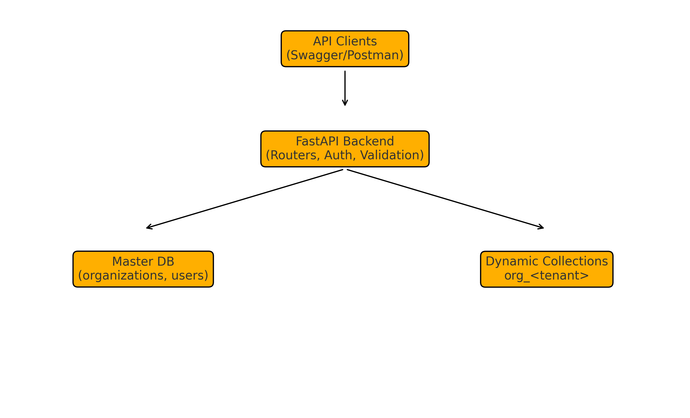

# ✨ **Multi-Tenant Organization Management Backend**

This project implements a multi-tenant organization management system using **FastAPI** and **MongoDB**.
Each organization is assigned its own isolated collection, while global metadata and admin details are stored in a master database.
The system includes endpoints for creating, updating, deleting organizations and managing admin authentication.

---

# 🚀 **Features**

### 🔹 Create Organization (`POST /org/create`)

* Ensures organization name is unique
* Creates MongoDB collection: `org_<organization_name>`
* Registers admin user with hashed password
* Saves metadata in master database

### 🔹 Admin Login (`POST /admin/login`)

* Validates admin credentials
* Returns JWT token with admin and tenant details

### 🔹 Get Organization (`GET /org/get`)

Fetches organization metadata from the master database.

### 🔹 Update Organization (`PUT /org/update`)

* Updates organization name
* Migrates data to a new collection if renamed
* Updates admin email or password

### 🔹 Delete Organization (`DELETE /org/delete`)

* Allowed only for authenticated admin
* Deletes collection, metadata, and admin entry

---

# 🏗️ **High-Level Architecture Diagram**



---

# 🧱 **Architecture Overview**

```
Client (Swagger/Postman)
        |
        ▼
FastAPI Backend (Routes, Validation, JWT Authentication)
        |
 ┌──────┴─────────────────────────┐
 │                                 │
 ▼                                 ▼
Master Database             Dynamic Collections
(org metadata)             org_<organization_name>
```

---

# 📂 **Project Structure**

```
fastapi-multitenant/
│
├── app/
│   ├── main.py
│   ├── db.py
│   ├── utils.py
│   ├── schemas.py
│   └── __init__.py
│
├── architecture_diagram.png
├── .env.example
├── requirements.txt
└── README.md
```

---

# ⚙️ **Environment Variables**

Create a `.env` file:

```env
MONGO_URI=mongodb://localhost:27017
MASTER_DB=master_db
JWT_SECRET=secret123
JWT_ALGORITHM=HS256
ACCESS_TOKEN_EXPIRE_MINUTES=60
```

---

# ▶️ **Running the Project**

### 1️⃣ Clone the repository

```bash
git clone <your-repo-url>
cd fastapi-multitenant
```

### 2️⃣ Create and activate virtual environment

```bash
python -m venv venv
venv\Scripts\activate
```

### 3️⃣ Install dependencies

```bash
pip install -r requirements.txt
```

### 4️⃣ Start server

```bash
uvicorn app.main:app --reload
```

Swagger UI:
[http://127.0.0.1:8000/docs](http://127.0.0.1:8000/docs)

---

# 📌 **API Endpoints**

| Method | Endpoint     | Description                        |
| ------ | ------------ | ---------------------------------- |
| POST   | /org/create  | Create organization & admin        |
| GET    | /org/get     | Fetch organization metadata        |
| PUT    | /org/update  | Update organization details        |
| DELETE | /org/delete  | Delete organization (JWT required) |
| POST   | /admin/login | Admin login and token generation   |

---

# 🧠 **Design Choices & Trade-offs**

### ⚡ FastAPI

Chosen for speed, built-in validation, and clean structure.

### 🗄️ MongoDB

Great for flexible schemas and dynamic collection creation.

### 🏢 Multi-Tenant Model (Collection-per-organization)

**Pros:**

* Strong isolation
* Simple deletion and onboarding
* No schema conflicts

**Cons:**

* Many organizations → many collections
* Database-per-tenant model scales even better for large SaaS products

### 🔐 JWT Authentication

Provides stateless, secure, tenant-aware access control.

---

# 📝 **Brief Notes**

```
The system uses a master database for storing organization metadata and admin accounts. 
Each organization gets its own database collection, which keeps tenant data isolated and simplifies maintenance. 
FastAPI enables fast development and clear API structure, while JWT ensures secure access control.
This architecture works efficiently for small to medium multi-tenant systems and can be extended for larger deployments.
```

---


